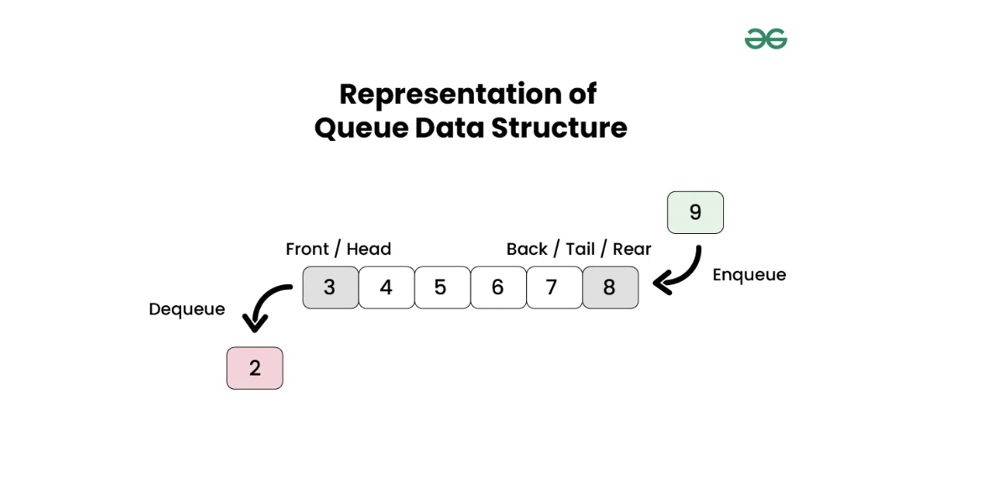

# Queue

It's a linear DS where operations are performed in FIFO order. We define a queue to be a list in which all additions to the list are made at one end (back of the queue), and all deletions from the list are made at the other end(front of the queue).  The element which is first pushed into the order, the delete operation is first performed on that.

### Representation

### Types

1. Simple - FIFO structure operations implementation.
2. [Double-Ended Queue (Deque)](./dequeue.md)
3. Circular Queue
4. Priority Queue

### Operations

1. Enqueue
2. Dequeue
3. Peek or front
4. Rear
5. isFull
6. isEmpty

All are performed in O(1) time with O(N) space.

### Real life applications

1. Cashier line in stores
2. CPU scheduling
3. Disk scheduling
4. Serving requests on a shared resource like printer

### Language Support

In C++, it's implemented via std::queue.

Operations - 
- queue.size()
- queue.front()
- queue.back()
- queue.push()
- queue.pop()
- queue.empty()

## Coding Problems

### Easy

1. Detect cycle in undirected graph using BFS
2. BFS
3. Traverse Directory
4. Vertical order traversal in Binary Tree
5. Print right view of Binary tree
6. Find minimum depth of binary tree
7. Check whether a given graph is bipartite or not

### Medium
1. Flatten a multilevel linked list
2. Levels with maximum number of linked list
3. Print all nodes between two given levels in Binary tree
4. Find next right node of a given key
5. Minimum steps to reach a target by a knight
6. Islands in a graph using BFS
7. Level order traversal line by line
8. Find first non-repeating character from a stream of characters

### Hard
1. Sliding window Maximum (Maximum of all subarrays of size K)
2. Flood fill algorithm
3. Minimum time required to rotten all oranges
4. Generate binary numbers from 1 to n
5. Maximum cost path from source node to destination node via at most K intermediate nodes
6. Shortest distance between two cells in a matrix or grid
7. Snake and Ladder problem
8. Minimum cost of simple path between two nodes in a directed and weighted graph
9. Minimum cost path in a directed graph via given set of intermediate nodes
10. Find first circular tour that visits all petrol pumps
