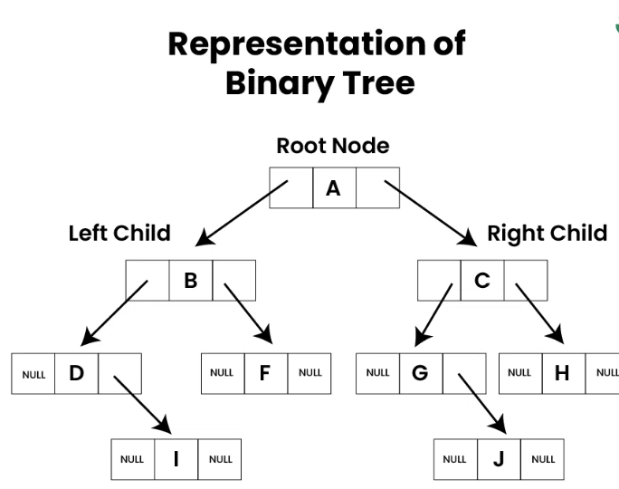

# Binary Tree

It's a non-linear data structure in which each node contains at most two children referred to as left and right child.

The topmost node is called root, while bottom-most nodes are called leaves. A binary tree can be visualized as a hierarchical structure with the root at the top and the leaves at the bottom.

## Representation



```cpp
// Use any below method to implement Nodes of tree

// Method 1: Using "struct" to make
// user-define data type
struct node {
    int data;
    struct node* left;
    struct node* right;
};

// Method 2: Using "class" to make
// user-define data type
class Node {
public:
    int data;
    Node* left;
    Node* right;
};
```

## Types

On basis of number of children -

1. Full Binary Tree
2. Degenerate Binary Tree
3. Skewed Binary Tree

On basis of completion of levels -

1. Complete Binary Tree
2. Perfect Binary Tree
3. Balanced Binary Tree

On basis of node values -

1. Binary Search Tree
2. AVL Tree
3. Red black tree
4. B Tree
5. B+ Tree
6. Segment Tree


## Traversal Of Tree

Traversing means visiting all the nodes. It can be classified into these - 

1. Depth first search - DFS
2. Breadth first search - BFS

### DFS

1. Pre-order traversal - Visit the current node before visiting any nodes inside the left or right subtrees. Here, the traversal is root – left child – right child. It means that the root node is traversed first then its left child and finally the right child.
2. Inorder traversal - Visit the current node after visiting all nodes inside the left subtree but before visiting any node within the right subtree. Here, the traversal is left child – root – right child.  It means that the left child is traversed first then its root node and finally the right child.
3. Postorder traversal - Visit the current node after visiting all the nodes of the left and right subtrees.  Here, the traversal is left child – right child – root.  It means that the left child has traversed first then the right child and finally its root node.

### BFS

Level order traversal - Visit nodes level-by-level and left-to-right fashion at the same level. Here, the traversal is level-wise. It means that the most left child has traversed first and then the other children of the same level from left to right have traversed.